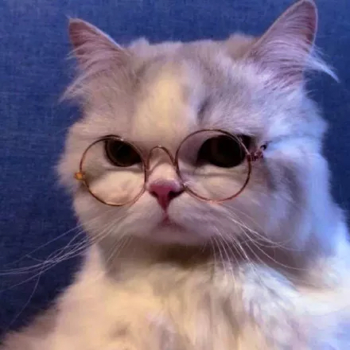
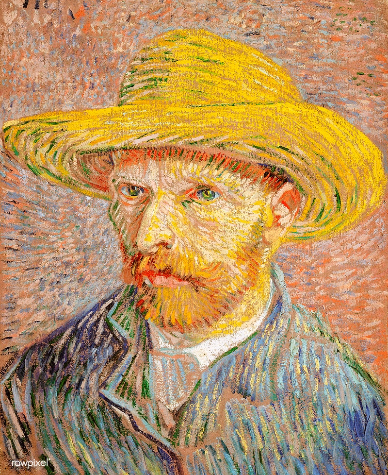
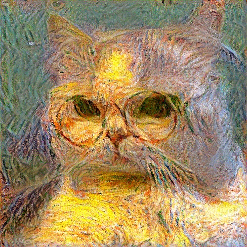
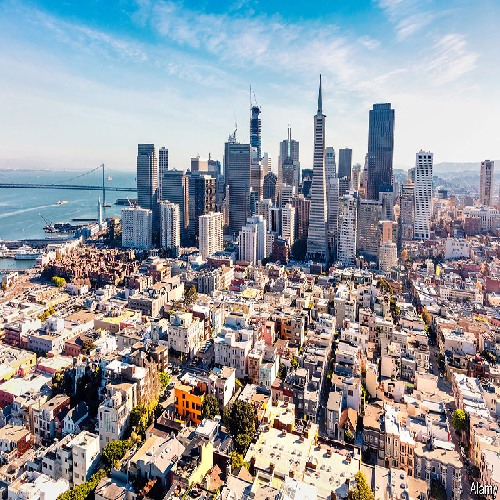
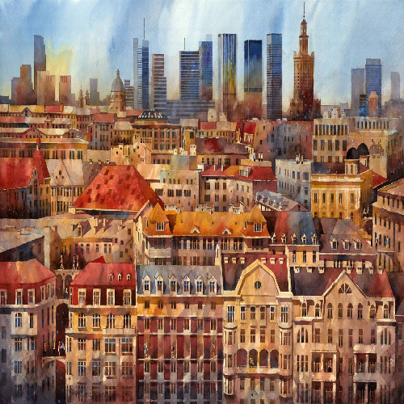
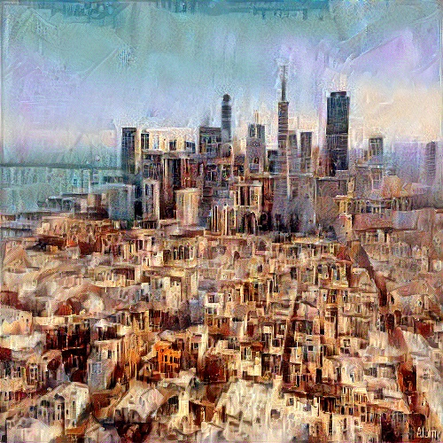
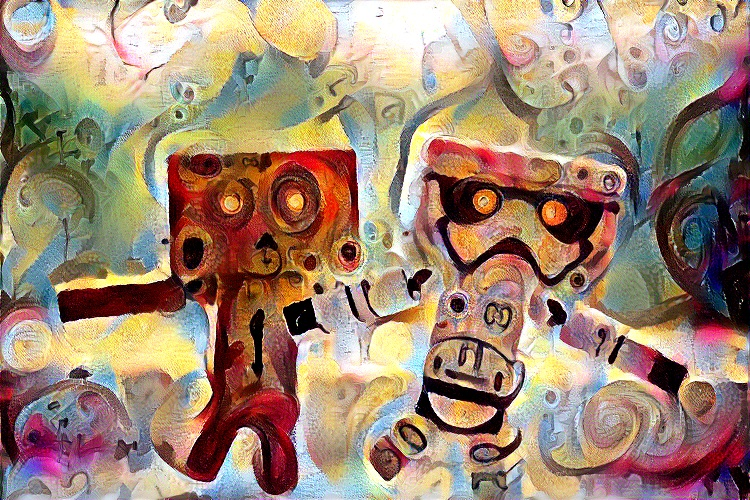

# pytorch-style-transfer

PyTorch Implementation For Style Transfer Algorithms

### usage

1. run `python3 run.py` to generate the style transfer image
2. the generated image at each step will be saved at `data/output_images/XXXX.jpg`

### Examples

Transfering style gives beautiful artistic results:

